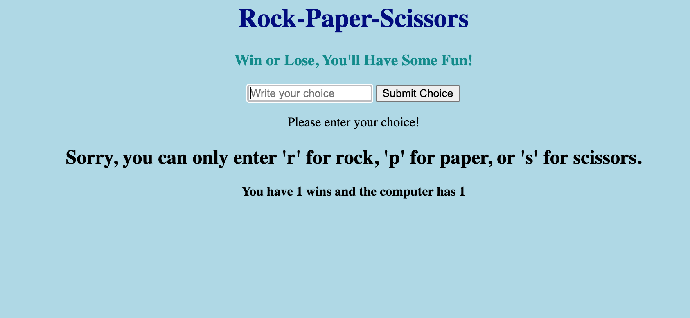

# Rock-Paper-Scissors-Javascript

This is a fully-functioning rock-paper-scissors game that runs on the browser. It counts the number of wins that the user has, as well as the computer's.

This game also gives you announcements based on the game result. Without having played, this screen appears:

 

If you win, the following screen appears:

 

If you lose, the following screen appears:

 

If you get tied, the following screen appears:

However, if you input anything that is not "r" for rock, "s" for scissors, or "p" for paper, the following error screen appears:

Inspired by the Python tutorial at https://www.youtube.com/watch?v=xRlN8CFJwAM
